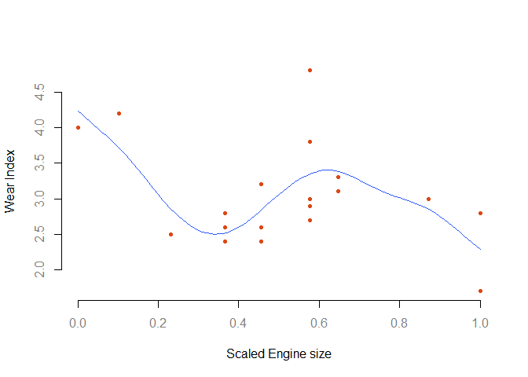

# Mixed Model Estimation, <br> a Connection to Additive Models,<br>and Beyond...


## Introduction
This following is based on Wood's 2006 text on additive models, chapter 6 in particular.  The goal is to express the tie between generalized additive models and mixed models, and open the door to further modeling expansion. It assumes familiarity with standard regression from a matrix perspective. 

## Model Formulation

We can start with a standard linear model expressed as follows:

$$\mathbf{y} = \mathbf{Xb} + \mathbf{\epsilon} $$

Here $\mathbf{y}$ is the target variable, $\mathbf{X}$ is a model matrix (first column representing the intercept, the rest are the covariates of interest), $\mathbf{b}$ are the coefficients, and error $\mathbf{\epsilon}$. Note that beyond this point I'll largely refrain from using bold to indicate vectors/matrices, or using subscripts for every *i*<sup>th</sup> observation. Let's just assume we are in a typical data situation involving multiple observations, a univariate vector target variable (y), a matrix of predictor variables (X) etc.

For a mixed model with a single random effect for some grouping factor (e.g. students within schools), this extends to:

$$y = Xb + Zg + \epsilon$$

Where Z is an indicator matrix pertaining to the grouping structure (sometimes referred to as dummy coding or one-hot encoding). Consider a factor z representing group/cluster membership, this would convert z to the following:


------------------
 z   ZA   ZB   ZC 
--- ---- ---- ----
 A   1    0    0  

 A   1    0    0  

 B   0    1    0  

 B   0    1    0  

 C   0    0    1  

 C   0    0    1  
------------------

The coefficients $g$ are the random effects, assumed $\mathcal{N}(0,\tau)$, and while we are often interested in them, they do not have to be estimated directly.

$$y = Xb + Zg + \epsilon \\
g \sim \mathcal{N}(0, \psi_\theta) \\
\epsilon \sim \mathcal{N}(0, \Lambda\sigma^2)$$

In this depiction $\psi_\theta$ can reflect some more interesting dependencies, but in the simple case of a random intercepts model it can be a single variance estimate $\tau^2$. $\Lambda$ can be used to model residual covariance but often is just the identity matrix, with the underlying assumption of constant variance $\sigma^2$ across observations.  

We can combine the random and residuals into a single construct reflecting the covariance structure of the observations:

$$ e = Zg + \epsilon $$

This makes $\mathbf{e}$ a multivariate vector with mean 0 and covariance (**I** is the unit matrix):

$$Z\psi_{\theta}Z^\intercal + I\sigma^2$$

This puts us back to a standard linear model:

$$ y = Xb + e, \\
e \sim \mathcal{N}(0, \Sigma_\theta\sigma^2)$$


## Maximum Likelihood Estimation

Given where we are now, we can proceed to estimate the mixed model. For this we'll use the sleepstudy data from lme4. The data has reaction times for 18 individuals over 10 days each (see the help file for the sleepstudy object for more details).

### Data

```r
data(sleepstudy, package='lme4')
X = model.matrix(~Days, sleepstudy)
Z = model.matrix(~factor(sleepstudy$Subject)-1)
y = sleepstudy$Reaction
```

### ML function
The following is based on the code in Wood (6.2.2), with a couple modifications for consistent nomenclature. $\theta$ represents the vector of parameters we wish to estimate. The (square root of the) variances will be estimated on the log scale. In Wood, he simply extracts the 'fixed effects' for the intercept and days effects using lm (6.2.3).


```r
llMixed = function(y, X, Z, theta){
  tau = exp(theta[1])
  sigma = exp(theta[2])
  n = length(y)
  
  # evaluate cov mat for y
  e = tcrossprod(Z)*tau^2 + diag(n)*sigma^2
  L = chol(e)  # L'L = e
  
  # transform dependent linear model to independent
  y = backsolve(L, y, transpose=TRUE)
  X = backsolve(L, X, transpose=TRUE)
  b = coef(lm(y~X-1))
  LP = X %*% b
  
  ll = -n/2*log(2*pi) -sum(log(diag(L))) - crossprod(y-LP)/2
  -ll
}
```


Here is an alternative function using a multivariate approach that doesn't use the transformation to independent, and might provide additional perspective.


```r
llMixedMV = function(y, X, Z, theta){
  tau = exp(theta[1])
  sigma = exp(theta[2])
  n = length(y)
  
  # evaluate cov mat for y
  e = tcrossprod(Z)*tau^2 + diag(n)*sigma^2

  b = coef(lm.fit(X, y))
  mu = X %*% b

  ll = -mvtnorm::dmvnorm(y, mu, e, log=T)
}
```


### Results

We'll use the optim function for estimation.  A slight change to tolerance is included to get a closer estimate to lme4.


```r
paramInit = c(0, 0)
names(paramInit) = c('tau', 'sigma')

modelResults = optim(llMixed, X=X, y=y, Z=Z, par=paramInit, control=list(reltol=1e-10))
modelResultsMV = optim(llMixedMV, X=X, y=y, Z=Z, par=paramInit, control=list(reltol=1e-10))

rbind(c(exp(modelResults$par), negLogLik = modelResults$value, coef(lm(y~X-1))),
      c(exp(modelResultsMV$par), negLogLik = modelResultsMV$value, coef(lm(y~X-1)))) %>% 
  round(2)
```

```
##        tau sigma negLogLik X(Intercept) XDays
## [1,] 36.02  30.9    897.04       251.41 10.47
## [2,] 36.02  30.9    897.04       251.41 10.47
```

As we can see, both formulations produce identical results. We can now compare those results to the lme4 output for the same model.


```r
library(lme4)
lmeMod = lmer(Reaction ~ Days + (1|Subject), sleepstudy, REML=FALSE)
lmeMod
```

```
## Linear mixed model fit by maximum likelihood  ['lmerMod']
## Formula: Reaction ~ Days + (1 | Subject)
##    Data: sleepstudy
##       AIC       BIC    logLik  deviance  df.resid 
## 1802.0786 1814.8505 -897.0393 1794.0786       176 
## Random effects:
##  Groups   Name        Std.Dev.
##  Subject  (Intercept) 36.01   
##  Residual             30.90   
## Number of obs: 180, groups:  Subject, 18
## Fixed Effects:
## (Intercept)         Days  
##      251.41        10.47
```

We can predict the random effects (Wood, 6.2.4), and after doing so again compare the results to the lme4 estimates.


```r
tau = exp(modelResults$par)[1]
tausq = tau^2
sigma = exp(modelResults$par)[2]
sigmasq = sigma^2
Sigma = tcrossprod(Z)*tausq/sigmasq + diag(length(y))
ranefEstimated = tausq*t(Z)%*%solve(Sigma) %*% resid(lm(y~X-1))/sigmasq
data.frame(ranefEstimated, lme4 = ranef(lmeMod)$Subject[[1]]) %>% round(2)
```

```
##                               ranefEstimated   lme4
## factor(sleepstudy$Subject)308          40.64  40.64
## factor(sleepstudy$Subject)309         -77.57 -77.57
## factor(sleepstudy$Subject)310         -62.88 -62.88
## factor(sleepstudy$Subject)330           4.39   4.39
## factor(sleepstudy$Subject)331          10.18  10.18
## factor(sleepstudy$Subject)332           8.19   8.19
## factor(sleepstudy$Subject)333          16.44  16.44
## factor(sleepstudy$Subject)334          -2.99  -2.99
## factor(sleepstudy$Subject)335         -45.12 -45.12
## factor(sleepstudy$Subject)337          71.92  71.92
## factor(sleepstudy$Subject)349         -21.12 -21.12
## factor(sleepstudy$Subject)350          14.06  14.06
## factor(sleepstudy$Subject)351          -7.83  -7.83
## factor(sleepstudy$Subject)352          36.25  36.25
## factor(sleepstudy$Subject)369           7.01   7.01
## factor(sleepstudy$Subject)370          -6.34  -6.34
## factor(sleepstudy$Subject)371          -3.28  -3.28
## factor(sleepstudy$Subject)372          18.05  18.05
```


## Additive model as a mixed model 

At this point I'd like to demonstrate some concepts from section 6.6 in Wood. Conceptually, the take home idea is that an additive model, or generalized additive model (GAM), can be seen as a mixed model, which is interesting in and of itself (at least to me), but it also means that GAMs meld nicely with mixed models generally.  For an intro on additive models, one can see my [document](https://sites.google.com/a/umich.edu/micl/miscfiles/GAMS.pdf), which is more or less an overview of Wood's text.

### Data set up

See Wood 3.2.  The data regards motor engine size and wear in 19 Volvos, with the initial assumption that larger capacity engines will wear out less quickly.


```r
size = c(1.42,1.58,1.78,1.99,1.99,1.99,2.13,2.13,2.13,2.32,2.32,2.32,2.32,2.32,2.43,2.43,2.78,2.98,2.98)
wear = c(4.0,4.2,2.5,2.6,2.8,2.4,3.2,2.4,2.6,4.8,2.9,3.8,3.0,2.7,3.1,3.3,3.0,2.8,1.7)

x = size - min(size)
x = x / max(x)
d = data.frame(wear, x)
```


### Relevant functions
We'll create functions for the cubic spline operation, the creation of a model matrix, the creation of the penalty matrix, and finally the fitting function.


```r
# cubic spline function
rk <- function(x, z) {
  ((z-0.5)^2 - 1/12) * ((x-0.5)^2 - 1/12) / 4 -
    ((abs(x-z)-0.5)^4 - (abs(x-z)-0.5)^2/2 + 7/240) / 24
}

# create the model matrix
splineX <- function(x, knots) {
  q <- length(knots) + 2 # number of parameters
  n <- length(x) # number of observations
  X <- matrix(1, n, q) # initialized model matrix
  X[, 2] <- x # set second column to x
  X[, 3:q] <- outer(x, knots, FUN = rk) # remaining to cubic spline
  X
}

# set up the penalized regression spline penalty matrix, given knot sequence xk
Sfunc = function(xk){
  q = length(xk)+2
  S = matrix(0, q, q) # initialize
  S[3:q, 3:q] = outer(xk, xk, FUN=rk)
  S
}

# Matrix sqrt function
matSqrt = function(S){
  UDU = eigen(S, symmetric=TRUE)
  U = UDU$vectors
  D = diag(UDU$values)
  B = crossprod(U) %*% sqrt(D)
  B
}

# the fitting function
prsFit <- function(y, x, knots, lambda) {
  q = length(knots) + 2 # dimension of basis
  n = length(x) # number of observations
  Xa = rbind(splineX(x, knots), matSqrt(Sfunc(knots)) * sqrt(lambda)) # augmented model matrix
  y[(n + 1):(n + q)] = 0 #augment the data vector
  lm(y ~ Xa - 1) # fit and return penalized regression spline
}
```

### Fit a penalized model

Now we can fit the model and visualize.


```r
xk = 1:7/8  # choose some knots
mod = prsFit(y=wear, x=x, knots=xk, lambda=.0001) # fit the penalized spline

xp = 0:100/100  # values for prediction
Xp = splineX(xp, xk)

plot(x, wear, xlab='Scaled Engine size', ylab='Wear Index', pch=19,
     col="#FF5503", cex=.75, col.axis='gray50', bty='n')
lines(xp,Xp%*%coef(mod), col='#2957FF') 
```

 

### As a mixed model

One can use the result of eigen decomposition on the penalty matrix to ultimately produce a re-parameterization of the original matrix as fixed and random effects components.


```r
S = Sfunc(xk)
init = eigen(S)
U = init$vectors
D = diag(init$values)
poseigen = which(diag(D) > 0)  
Dpos = D[poseigen, poseigen]           # smallest submatrix containing all positive values
Xf = splineX(x, knots = xk)            # spline model matrix
U_F = U[, (ncol(U)-1):ncol(U)]         # partition eigenvector matrix
U_R = U[, 1:(ncol(U)-ncol(U_F))]
X_F = Xf %*% U_F                       # fixed part  with B_F coef to be estimated (not penalized)
X_R = Xf %*% U_R                       # random part with B_R random effects
Z = X_R %*% sqrt(Dpos)
```

The above operations have effectively split the GAM into fixed and random parts:

$$\mathbf{X}_F\mathbf{\beta}_F + \mathbf{X}_R\mathbf{b}_R, \\
\mathbf{b}_R\sim \mathcal{N}(\mathbf{0}, \mathbf{D_+^{-1}}/\lambda) \\$$

Here $\lambda$ is a smoothing parameter, which controls the amount of smoothing. For a penalized spline, the loss function is:

$$\lVert y - X\beta \rVert^2 + \lambda\beta^{\intercal}S\beta ,$$

with the second part the added penalty. As $\lambda$ approaches infinity, we essentially get straight line fit, while a $\lambda$ of 0 would be the same as an unpenalized fit.


The Z in the code above represents part of the mixed model Z we had before in the standard mixed model. We can now represent our model as follows:

$$\mathbf{X}_F\mathbf{\beta}_F + \mathbf{Zg}, \\
\mathbf{g} \sim \mathcal{N}(\mathbf{0}, \mathbf{I}/\lambda) \\$$

To incorporate a gamm, i.e. a *generalized additive mixed model*, the X_F above would become part of the 'fixed' effect part of the model, while Z would be part of the random effects, and estimation would proceed normally as for a mixed model.  


Initially we'll just duplicate a standard mixed model using the mgcv and associated gamm4 package.


```r
library(mgcv); library(gamm4)
```

```
## This is gamm4 0.2-3
```

```r
sleepstudy$Subject = factor(sleepstudy$Subject)
modGam = gamm4(Reaction ~ Days, random=~(1|Subject), data=sleepstudy)
summary(modGam$mer)
```

```
## Linear mixed model fit by REML ['lmerMod']
## 
## REML criterion at convergence: 1786.5
## 
## Scaled residuals: 
##     Min      1Q  Median      3Q     Max 
## -3.2257 -0.5529  0.0109  0.5188  4.2506 
## 
## Random effects:
##  Groups   Name        Variance Std.Dev.
##  Subject  (Intercept) 1378.2   37.12   
##  Residual              960.5   30.99   
## Number of obs: 180, groups:  Subject, 18
## 
## Fixed effects:
##              Estimate Std. Error t value
## X(Intercept) 251.4051     9.7467   25.79
## XDays         10.4673     0.8042   13.02
## 
## Correlation of Fixed Effects:
##       X(Int)
## XDays -0.371
```


Now we'll add a cubic spline for the effect of Days.  We can see the smooth term listed as random effect.

```r
modGamS = gamm4(Reaction ~ s(Days, bs='cs'), random=~(1|Subject), data=sleepstudy)
summary(modGamS$mer)    
```

```
## Linear mixed model fit by REML ['lmerMod']
## 
## REML criterion at convergence: 1795.3
## 
## Scaled residuals: 
##     Min      1Q  Median      3Q     Max 
## -3.2996 -0.5224  0.0399  0.5340  4.2989 
## 
## Random effects:
##  Groups   Name        Variance Std.Dev.
##  Subject  (Intercept) 1378.144 37.123  
##  Xr       s(Days)        4.455  2.111  
##  Residual              960.806 30.997  
## Number of obs: 180, groups:  Subject, 18; Xr, 9
## 
## Fixed effects:
##   Estimate Std. Error t value
## X   298.51       9.05   32.98
```

```r
# summary(modGamS$gam)
plot(modGamS$gam)
```

 


## Wrap Up
So we've seen that GAMs can be seen as having a fixed and random effect as in mixed models, which means we can use them within the mixed model framework. Another way to look at this is that we have added the capacity to examine nonlinear relationships and other covariance structures to the standard mixed model framework, making a very flexible modeling approach even more so.

### It's full of STARs...
However, this goes even further.  ***St****ructured* ***A****dditive* ***R****egression models* (STAR) build upon the notion just demonstrated. Not only we can combine mixed and additive models, but other model classes as well.  This includes interactions and varying coefficient models, spatial effects, gaussian processes/kriging, markov random fields and others.  Each model class has a particular design and penalty matrix, but otherwise can be added to the current model considered.  We can also use other techniques, like boosting (which itself can be seen as an additive modeling approach!) to estimate them. Standard regression, glm, gam, etc. are thus special cases of the STAR model. In short, we now have a highly flexible modeling environment within which to tackle the questions we seek to answer with our data.
