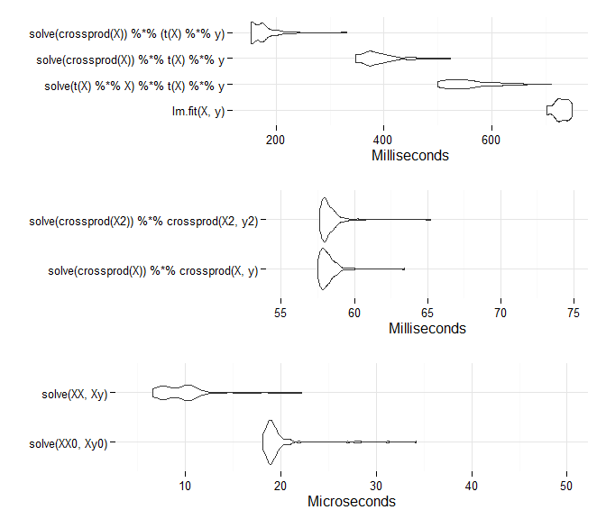

# Matrix Speedups in R
MC  

## Intro and Data Prep
The following provides some food for thought when creating or manipulating your data in R.  As we'll see, even just organizing your matrix operations to create smaller objects, or using R's built in vectorized approaches can go a long way toward more efficient processing in terms of time and/or memory.


To demonstrate we'll look at a linear regression with a large row-wise data set, large enough to see some of the timing differences.  We'll demonstrate the [normal equations](https://en.wikipedia.org/wiki/Linear_least_squares_%28mathematics%29#Derivation_of_the_normal_equations) and via the standard lm approach.


```r
set.seed(1234)
n = 10000000
x = rnorm(n)

y =  5 + 2*x + rnorm(n)

X = cbind(1, x)

# normal equations to get coefficients
solve(crossprod(X)) %*% crossprod(X,y)
```

```
##       [,1]
##   4.999339
## x 1.999691
```

Compare to the lm approach.


```r
lm(y ~ x)
```

```
## 
## Call:
## lm(formula = y ~ x)
## 
## Coefficients:
## (Intercept)            x  
##       4.999        2.000
```


## Standard LM
First, we'll look at lm as a baseline.


```r
system.time(lm(y ~ x))
```

```
##    user  system elapsed 
##   11.98    0.34   12.32
```

A fairly slow operation, but one look at the lm function tells you its also doing a lot of other things.  

```r
head(lm, 20)
```

```
##                                                                           
## 1  function (formula, data, subset, weights, na.action, method = "qr",    
## 2      model = TRUE, x = FALSE, y = FALSE, qr = TRUE, singular.ok = TRUE, 
## 3      contrasts = NULL, offset, ...)                                     
## 4  {                                                                      
## 5      ret.x <- x                                                         
## 6      ret.y <- y                                                         
## 7      cl <- match.call()                                                 
## 8      mf <- match.call(expand.dots = FALSE)                              
## 9      m <- match(c("formula", "data", "subset", "weights", "na.action",  
## 10         "offset"), names(mf), 0L)                                      
## 11     mf <- mf[c(1L, m)]                                                 
## 12     mf$drop.unused.levels <- TRUE                                      
## 13     mf[[1L]] <- quote(stats::model.frame)                              
## 14     mf <- eval(mf, parent.frame())                                     
## 15     if (method == "model.frame")                                       
## 16         return(mf)                                                     
## 17     else if (method != "qr")                                           
## 18         warning(gettextf("method = '%s' is not supported. Using 'qr'", 
## 19             method), domain = NA)                                      
## 20     mt <- attr(mf, "terms")
```

Many modeling functions are actually wrappers to the true underlying fit function, and as long as you can still get the specific results you want, sometimes it's worth using them directly.  In this case we can use lm.fit and see what kind of speed gain is possible. As the following demos can be fairly quick, we'll use microbenchmark and execute each task 10 times.


```r
library(microbenchmark)
resLM = microbenchmark(lm.fit(X, y), times=10)
resLM
```

```
## Unit: milliseconds
##          expr      min       lq     mean   median       uq      max neval
##  lm.fit(X, y) 693.7104 720.9308 740.8531 725.7511 753.6893 857.3634    10
```


Even though lm.fit is doing quite a bit under the hood also, we still get a clear improvement in time, where we've gone from over 10 seconds to less than a second.  I also looked at a simulation style approach with n of 1000 and 1000 simulated x's and y's based on the same setup, and the results were similar, so we're not having to restricting ourselves to only big data situations.  Let's see what else we can do.

## Matrix Operations and R functions
Now we'll try various approaches to the matrix operations that can produce the model coefficients, and time them to see which approach might be fastest.  For the first alternative approach, we can start with an explicit matrix operations as depicted in textbooks. 


```r
res0 = microbenchmark(solve(t(X) %*% X) %*% t(X) %*% y, times=10)
res0
```

```
## Unit: milliseconds
##                              expr      min       lq     mean   median      uq      max neval
##  solve(t(X) %*% X) %*% t(X) %*% y 501.5694 508.6635 521.9195 513.8071 515.953 614.9693    10
```


### Using the crossprod function
As far as speed goes, we're getting a little faster still, and though it might not seem like much, it's about a 29 % reduction in median time (though again, lm.fit is doing a lot more). Let's try using the crossprod function. 


```r
res1 = microbenchmark(solve(crossprod(X)) %*% t(X) %*% y, times=10)
res1
```

```
## Unit: milliseconds
##                                expr      min       lq     mean   median       uq      max neval
##  solve(crossprod(X)) %*% t(X) %*% y 355.2864 355.8258 356.7393 356.5472 356.6783 360.5037    10
```


Even just that slight change provides improvement, a   % reduction compared to the previous approach. The crossprod function is a slightly faster implementation of the otherwise same operation.  

### Grouping
However, we can still do better.  Let's now group the operation on the right and see what we get.  


```r
res2 = microbenchmark(solve(crossprod(X)) %*% (t(X) %*% y), times=10)
res2
```

```
## Unit: milliseconds
##                                  expr     min       lq     mean   median       uq      max neval
##  solve(crossprod(X)) %*% (t(X) %*% y) 153.276 153.9631 162.0335 157.1794 163.1432 195.6953    10
```

More improvement.  With this approach we have a final operation between a 2x2 matrix with a 2x1 matrix, whereas in the previous one we only get the crossprod gain, but are otherwise dealing with a 2x2 matrix, a 2xN matrix, and a Nx1 vector requiring more internal operations to be performed.  While they are simple operations, they do add up.


As a final approach using just base R options, we can use the code initially presented at the beginning in which we use crossprod for the X covariance and Xy covariance.


```r
res3 = microbenchmark(solve(crossprod(X)) %*% crossprod(X,y), times=10)
res3
```

```
## Unit: milliseconds
##                                     expr      min       lq     mean   median       uq      max neval
##  solve(crossprod(X)) %*% crossprod(X, y) 57.74971 57.98236 60.75807 58.87828 63.59472 65.67474    10
```

Now that's *much* faster.

### Matrix package
Even then, there are still tools with R packages that might be useful for either speed or memory gains.  The following demonstrates the use of the Matrix package which is comparable for this problem but might be more generally efficient in some situations. 


```r
library(Matrix)
X2 = Matrix(X); class(X2)
```

```
## [1] "dgeMatrix"
## attr(,"package")
## [1] "Matrix"
```

```r
y2 = Matrix(y)

res4 = microbenchmark(solve(crossprod(X2)) %*% crossprod(X2, y2), times=10)
res4
```

```
## Unit: milliseconds
##                                        expr      min      lq     mean   median      uq      max neval
##  solve(crossprod(X2)) %*% crossprod(X2, y2) 57.69088 57.7332 58.77757 57.87204 58.0457 66.48075    10
```

```r
XX = crossprod(X2)
Xy = crossprod(X2, y2)
solve(XX, Xy)
```

```
## 2 x 1 Matrix of class "dgeMatrix"
##          [,1]
## [1,] 4.999339
## [2,] 1.999691
```

```r
res4b = microbenchmark(solve(XX, Xy), times=10)
res4b
```

```
## Unit: microseconds
##           expr   min    lq    mean median    uq    max neval
##  solve(XX, Xy) 6.904 7.505 11.2272  7.805 8.106 41.426    10
```

Note that the results in 4b are in microseconds rather than milliseconds.  Compare to base R crossprod with matrix classes.


```r
XX0 = crossprod(X)
Xy0 = crossprod(X, y)
microbenchmark(solve(XX0, Xy0), solve(XX, Xy), times=100)
```

```
## Unit: microseconds
##             expr    min      lq     mean median     uq     max neval cld
##  solve(XX0, Xy0) 18.612 19.8125 28.57231 20.113 21.014 579.668   100   b
##    solve(XX, Xy)  6.904  8.4060 10.33878 10.207 11.107  26.417   100  a
```

Thus using Matrix S4 classes can result in notable speedups as well.  See the associated [vignettes](http://cran.r-project.org/package=Matrix) for more information.

## Visual Summary of Benchmarks

A quick visual comparison, and we'll do the operations 100 times.


```r
res5 = microbenchmark(lm.fit(X, y), 
                      solve(t(X) %*% X) %*% t(X) %*% y,
                      solve(crossprod(X)) %*% t(X) %*% y, 
                      solve(crossprod(X)) %*% (t(X) %*% y), times=100)
res6 = microbenchmark(solve(crossprod(X)) %*% crossprod(X, y),
                      solve(crossprod(X2)) %*% crossprod(X2, y2), times=100)
res7 = microbenchmark(solve(XX0, Xy0), solve(XX, Xy), times=100)
```

 


## Alternatives
I've focused on matrix/vectorized operations here, but there are many ways to speed up R generally speaking. 


### Parallelism
Parallelism is possible for a lot of common, iterative operations one does in statistical programming.  If you're waiting minutes or hours for multiple tasks or models to run, you should at least try to get comfortable with R's parallel package that comes with the base installation.  But for a glimpse at the myriad possibilities, see the CRAN Task View for [high performance computing](http://cran.r-project.org/web/views/HighPerformanceComputing.html).  I would add [Spark R](https://amplab-extras.github.io/SparkR-pkg/) as something to keep an eye on as well.

### Other packages 
Several package like the 'big' family (e.g. biglm) are useful for memory intensive data and specifically geared for bigger data situation.  With such a simple model demonstrated here it offers no advantage though. See also, speedglm, whose speedlm.fit was about five times faster than lm.fit.  In addition, many packages can take advantage of your parallel setup.


### Alternative Rs 
In addition there are several projects that could further enhance the speed capabilities of your R.  The following list is certainly not exhaustive, but does provide some places to go for further examination.

- A list from Wickham's book [link](http://adv-r.had.co.nz/Performance.html#faster-r)
- Revolution Analytics [RRO](http://mran.revolutionanalytics.com/download/#download)

### Alternate libraries
- R via the Atlas library [link](http://cran.r-project.org/bin/windows/contrib/ATLAS/)  (32 bit only)

### Just in time compiler
Compiled functions will typically run faster, and we can use the compiler package for this.  However, it's not always apparent when this would be useful as many functions are can take on complexity that would nullify the gains otherwise seen, or are using functions that R internally compiled already.


```r
library(compiler)
# from ?compile
myFunc = function(X, FUN, ...) {
  FUN <- match.fun(FUN)
  if (!is.list(X))
  X <- as.list(X)
  rval <- vector("list", length(X))
  for (i in seq(along = X))
  rval[i] <- list(FUN(X[[i]], ...))
  names(rval) <- names(X)
  return(rval)
}


# enableJIT(0)
myFuncCompiled = cmpfun(myFunc)

microbenchmark(myFunc(1:100, is.null), myFuncCompiled(1:100, is.null))
```

```
## Unit: microseconds
##                            expr     min       lq      mean   median       uq     max neval cld
##          myFunc(1:100, is.null) 151.896 157.0000 167.13716 160.1515 169.0075 324.506   100   b
##  myFuncCompiled(1:100, is.null)  57.336  61.8395  68.21845  63.9410  73.6970 122.778   100  a
```

## Summary

In general it is best to familiarize oneself with some of the ways in which to speed up code.  For more advanced R users, it's a must, but any R user can benefit. But don't forget programming time either.  Even if R is slower than other language options, the greatest speed benefit is comes from all the coding time saved by using it in the first place.
