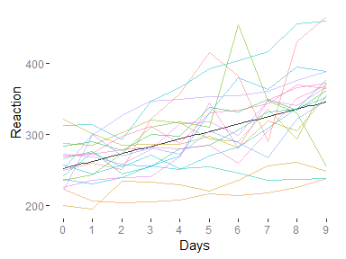
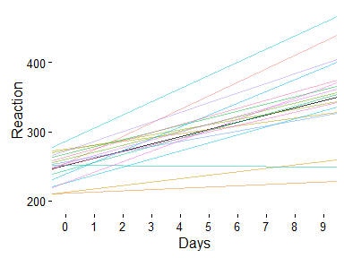

Thinking About Mixed Models
================
Michael Clark
Statistician Lead
CSCAR, ARC, U of Michigan
2016-03-26

-   [Preface](#preface)
-   [Introduction](#introduction)
-   [Standard Linear Model](#standard-linear-model)
-   [Applied Example](#applied-example)
-   [Many ways to write the same model](#many-ways-to-write-the-same-model)
    -   [Mixed Model 1a: Allowing coefficients to vary across groups](#mixed-model-1a-allowing-coefficients-to-vary-across-groups)
    -   [Mixed Model 1b: Multilevel model](#mixed-model-1b-multilevel-model)
    -   [Mixed Model 2: Combining separate local regressions](#mixed-model-2-combining-separate-local-regressions)
    -   [Mixed Model 3a: Design matrix for random component](#mixed-model-3a-design-matrix-for-random-component)
    -   [Mixed Model 3b: Design matrix again](#mixed-model-3b-design-matrix-again)
    -   [Mixed Model 3c: General notation](#mixed-model-3c-general-notation)
    -   [Mixed Model 4a: Regression with multiple error terms](#mixed-model-4a-regression-with-multiple-error-terms)
    -   [Mixed Model 4b: Conditional vs. marginal model](#mixed-model-4b-conditional-vs.-marginal-model)
    -   [Mixed Model 5a: Regression with correlated errors](#mixed-model-5a-regression-with-correlated-errors)
    -   [Mixed Model 5b: Multivariate normal model](#mixed-model-5b-multivariate-normal-model)
    -   [Mixed Model 6: Penalized regression](#mixed-model-6-penalized-regression)
    -   [Mixed Model 7: Bayesian mixed model](#mixed-model-7-bayesian-mixed-model)
-   [Simulate a mixed model](#simulate-a-mixed-model)
-   [Applied Example](#applied-example-1)
-   [Other topics](#other-topics)
-   [Summary](#summary)
-   [Appendix](#appendix)
    -   [Simulation with random intercepts and slopes](#simulation-with-random-intercepts-and-slopes)
-   [References & Notes](#references-notes)

Preface
=======

This document is intended as a reference for those starting out with what we'll simply call *mixed models*. Some parts would be suitable to anyone in an applied discipline with no more knowledge than that of standard regression (e.g. the beginning, models 1-2, end), while other parts assume familiarity with matrix notation and/or other relatively advanced knowledge. Hopefully folks of varying backgrounds can find it useful.

The motivation here is that one could open up different sources with content pertaining to mixed models, and feel like none of them are talking about the same thing. They'll use different terminology and different model depictions, and where one might be feeling ok after reading some of it, find their knowledge loosen upon perusing the next description. This is an attempt to help with that situation, and one that I hope will not simply add to the confusion.

Introduction
============

Mixed models are an extremely useful modeling tool for clustered data situations. It is quite common to have data in which we have repeated measurements for the units of observation, or in which the units of observation are otherwise clustered (e.g. students within school, cities within geographic region). Mixed models can deal with such data in a variety of ways, but for the uninitiated, the terminology, especially across disciplines, can be a bit daunting.

Some terms you might come across regarding mixed models:

-   Variance components
-   Random intercepts and slopes
-   Random effects
-   Random coefficients
-   Varying coefficients
-   Intercepts and slopes-as-outcomes
-   Hierarchical linear models
-   Multilevel models
-   Growth curve models (possibly Latent GCM)
-   Mixed effects models

All describe types of mixed models. Some might be more historical, others are more often seen in a specific discipline, others might refer to a certain data structure (e.g. multilevel clustering), and still others are special cases. <span class="emph">Mixed effects</span>, or simply mixed, models generally refer to a mixture of fixed and random effects. I prefer the term mixed models because it is simple and no specific structure is implied[1]. <span class="emph">Fixed effects</span>, as we will see later, is perhaps a poor but nonetheless stubborn term for the typical main effects one would see in a linear regression model, i.e. the non-random part of a mixed model, and in some contexts they are referred to as the *population average* effect.

Alternative approaches used in clustered data situations include:

-   Using cluster-robust standard errors
-   Fixed effects models (also panel linear models with fixed, as opposed to random, effects)
-   Generalized estimating equations

The first two are commonly used by those trained with an econometrics perspective, while you might see gee more with those of a biostatistics perspective (see the marginal model below for some perspective). They will not be considered here. I personally don't use them because they generally do not answer questions I have for clustered data situations, do not generalize to more complex clustering situations, or in other situations would only tell you what a mixed model would anyway.

Standard Linear Model
=====================

First let's begin with the standard linear model to get used to the notation. To keep things as simple as possible while still being generalizable to common data situations, I will posit some variable of interest \(y\) and one continuous/numeric covariate.

The following is a standard regression without any clustering.

\[y_i = \alpha + \beta X_i + e_i\] \[e_i \sim \mathcal{N}(0, \sigma^2)\]

We have observations \(i = 1....n\), the intercept \(\alpha\), and \(\beta\) is the effect of the covariate \(X\). The error term is assumed normally distributed with a mean of 0 and variance \(\sigma^2\).

Another way to write this focuses on the data generating process rather than 'error':

\[\mu_i = \alpha + \beta X_i\] \[y_i \sim \mathcal{N}(\mu_i, \sigma^2)\]

and in matrix form:

\[\boldsymbol{\mu =  X\beta}\] \[\boldsymbol{y} \sim \mathcal{N}(\boldsymbol{\mu}, \sigma^2)\]

For the matrix depiction, \(X\) is an \(n\textrm{ x } p\) model matrix that includes a column of ones for the intercept and columns for each covariate, while \(\beta\) is a vector of \(p\) regression coefficients. \(y\) is normally distributed with mean \(\mu\) and constant variance \(\sigma^2\) for all \(y_i\). When we move to mixed models, we will display the models similarly.

A word about notation. In what follows I try to strike a balance between conceptual simplicity and consistency with what is typically seen elsewhere, which can often be confusing depending on the source. The notation can get cumbersome for more complex models, and/or not in keeping with how it would actually be coded if one was estimating the model on their own. As an example, in the last line I suppress the subscript \(i\)s (\(y_i \sim \mathcal{N}(\mu_i, \sigma^2)\)), or the \(\boldsymbol{I_n}\sigma^2\) (\(\boldsymbol{y} \sim \mathcal{N}(\boldsymbol{\mu}, \boldsymbol{I_n}\sigma^2)\)), because I think more from a vectorized programming approach, which I think provides a means for a more succinct notation than usual without loss of clarity. As an example, in code, the above is:

``` r
μ = X %*% β
y = rnorm(n, μ, σ²)
```

In attempting the balance, I suspect the approach may succeed or fail in varying degree along the way, but between the notation and the code (something sorely lacking in many textbook presentations), I hope things will be fairly clear.

Applied Example
===============

Let's take a look at some data to get started thinking about mixed models. I'll use the sleepstudy data from the <span class="pack">lme4</span> package. The following description comes from the corresponding help file.

> The average reaction time per day for subjects in a sleep deprivation study. On day 0 the subjects had their normal amount of sleep. Starting that night they were restricted to 3 hours of sleep per night. The observations represent the average reaction time (in milliseconds) on a series of tests given each day to each subject.

Let's use a standard linear model to explore the effect of continued sleep deprivation on reaction time.

``` r
data(sleepstudy, package='lme4')
slim = lm(Reaction ~ Days, data=sleepstudy)
summary(slim)
```

    ## 
    ## Call:
    ## lm(formula = Reaction ~ Days, data = sleepstudy)
    ## 
    ## Residuals:
    ##      Min       1Q   Median       3Q      Max 
    ## -110.848  -27.483    1.546   26.142  139.953 
    ## 
    ## Coefficients:
    ##             Estimate Std. Error t value Pr(>|t|)    
    ## (Intercept)  251.405      6.610  38.033  < 2e-16 ***
    ## Days          10.467      1.238   8.454 9.89e-15 ***
    ## ---
    ## Signif. codes:  0 '***' 0.001 '**' 0.01 '*' 0.05 '.' 0.1 ' ' 1
    ## 
    ## Residual standard error: 47.71 on 178 degrees of freedom
    ## Multiple R-squared:  0.2865, Adjusted R-squared:  0.2825 
    ## F-statistic: 71.46 on 1 and 178 DF,  p-value: 9.894e-15

With the positive coefficient for Days, we see that more sleep deprivation results in increased/slower reaction times. But let's plot the data.



What does this tell us? The black line is what our current model is suggesting, i.e. it assumes a single starting point and the same trajectory for everyone. However, we see that subjects have starting points that might have as much as 100ms difference. In addition, while the slope is generally positive, a few show little to no change over time. In other words, there is notable variability with both individuals' intercepts and slopes. We'll come back to this data towards the end.

Many ways to write the same model
=================================

So we want to take into account the clustered nature of the data. Instead of ignoring the clustering as in the SLiM above, we might think of running completely separate regressions for each individual. However the models would typically be run on very little data and be overly contextualized. As we'll see, mixed models will allow for random intercepts and slopes for each person, and take clustering into account while not being too individual-specific.

How might this model be depicted? It turns out it can and is shown in a variety of ways, depending on the text or article you may be looking at. The following is inspired by [Gelman & Hill](http://www.stat.columbia.edu/~gelman/arm/) (2007), where they show five ways to write a mixed model. For simplicity we will typically only concern ourselves with a random intercepts model, but will from time to time extend beyond that setting. The first couple formulations require no more than an understanding of standard regression models, but more knowledge is assumed with other model depictions.

Mixed Model 1a: Allowing coefficients to vary across groups
-----------------------------------------------------------

Here is a first step in which we have observations \(i\) nested within clusters \(c\).

\[y_{ic} = \alpha_{c} + \beta X_{ic} + e_{ic}\] \[\alpha_c \sim \mathcal{N}(\mu_\alpha, \tau^2)\] \[e_{ic} \sim \mathcal{N}(0, \sigma^2)\]

In the above, each observation \(i\) within cluster \(c\) has an intercept \(\alpha\) depending on what cluster \(c\) it belongs to. The \(\alpha_c\) are assumed normally distributed with mean \(\mu_\alpha\) and variance \(\tau^2\). \(\mu_\alpha\) is the overall intercept we'd see in the SLiM approach. The \(e\) are mean zero normally distributed as depicted in the SLiM.

For each model depiction I'll note one of the primary references where one can see it in near identical form that particular text or article. It will not be the only reference that does, but at least it should be one that will provide some additional perspective.

(Gelman and Hill 2007)

Mixed Model 1b: Multilevel model
--------------------------------

Instead we might write the second part as follows, which is a common way to do so in the 'multilevel modeling' literature. The level one model is as before, and for the cluster level, or level two, model we show it a bit differently:

\[y_{ic} = \alpha_{c} + \beta X_{ic} + e_{ic}\] \[\alpha_c = \mu_\alpha + \gamma_c\] \[\gamma_c \sim \mathcal{N}(0, \tau^2)\]

Here, the *random* effects \(\gamma_c\), which come from a normal distribution with zero mean and \(\tau^2\) variance, are perhaps more clearly seen as cluster-specific deviations from the overall (population) intercept \(\mu_\alpha\). Likewise, \(\beta\) also does not vary, and together \(\beta\) and \(\mu_\alpha\) are our *fixed* effects.

In this formulation, it looks like we are modeling the coefficients themselves, and this is where one might hear of 'intercepts and slopes as outcomes', though that terminology seems less common these days. However, we can add cluster level covariates if desired. For example, with repeated observations nested within people, a cluster level variable might represent the sex of the individual or even the cluster mean of the some level 1 covariate.

If we plug \(\alpha_c\) (without any cluster level predictor) into the first line, our model becomes:

\[y_{ic} = (\mu_\alpha  + \gamma_{c}) + \beta X_{ic} + e_{ic}\]

Above, we can think of the \(\gamma\) as a cluster specific regression coefficient by adding them to the intercept, resulting in a *random intercepts* model.

Alternatively, we can think of them as another *component* of variation (error), and lump them in with the \(e\):

\[y_{ic} = \mu_\alpha + \beta X_{ic} + (\gamma_{c} + e_{ic})\]

We'll revisit these two ways of considering the model again later.

(Gelman and Hill 2007)

Mixed Model 2: Combining separate local regressions
---------------------------------------------------

Within some cluster \(c\), we could write the model this way.

\[y_i \sim \mathcal{N}(\alpha_c + \beta X_i, \sigma^2)\]

Where i = 1,..., \(n_c\). However, this depiction ignores any cluster level predictors we might be interested in. If we want to include those, we might add

\[\alpha_c \sim \mathcal{N}(\mu_\alpha + \beta^\text{*}X^\text{*}_c, \tau^2)\]

as we did in [Model 1b](#mixed-model-1b-multilevel-depiction), where \(X^\text{*}_c\) is a cluster level predictor that does not vary within a cluster. The mixed model combines the separate regressions approach by keeping the fixed effects the same across clusters, and connecting the \(\alpha_c\) through the above equation. In other words, the mixed model falls between an approach that ignores the clusters all together (as the SLiM would), and one that would run completely separate regressions for each cluster. We'll revisit this notion later.

(Gelman and Hill 2007)

Mixed Model 3a: Design matrix for random component
--------------------------------------------------

If we switch to matrix notation, we can see the model in still other ways. To get our bearings, I'll first show the SLiM again.

\[\boldsymbol{\mu = X\beta}\] \[\boldsymbol{y} \sim \mathcal{N}(\boldsymbol{\mu}, \sigma^2) \]

X is a design matrix with a column of 1s representing the intercept and the other columns are the covariates of interest. \(\beta\) is the vector of regression coefficients. Here \(\mu\) represents the linear predictor.

Let's start with a random intercepts model. Now let Z be an indicator matrix representing the \(1 \dots m\) clusters in some variable z. For example, if there were 3 clusters of A, B, and C, Z looks like the following:

<table style="width:26%;">
<colgroup>
<col width="5%" />
<col width="6%" />
<col width="6%" />
<col width="6%" />
</colgroup>
<thead>
<tr class="header">
<th align="center">z</th>
<th align="center">ZA</th>
<th align="center">ZB</th>
<th align="center">ZC</th>
</tr>
</thead>
<tbody>
<tr class="odd">
<td align="center">A</td>
<td align="center">1</td>
<td align="center">0</td>
<td align="center">0</td>
</tr>
<tr class="even">
<td align="center">A</td>
<td align="center">1</td>
<td align="center">0</td>
<td align="center">0</td>
</tr>
<tr class="odd">
<td align="center">B</td>
<td align="center">0</td>
<td align="center">1</td>
<td align="center">0</td>
</tr>
<tr class="even">
<td align="center">B</td>
<td align="center">0</td>
<td align="center">1</td>
<td align="center">0</td>
</tr>
<tr class="odd">
<td align="center">C</td>
<td align="center">0</td>
<td align="center">0</td>
<td align="center">1</td>
</tr>
<tr class="even">
<td align="center">C</td>
<td align="center">0</td>
<td align="center">0</td>
<td align="center">1</td>
</tr>
</tbody>
</table>

Note that unlike traditional dummy coding, we have an indicator for all groups. Z is actually a per cluster design matrix, which in this case has only an intercept. We'll see that more clearly soon enough. With Z the model becomes:

\[\boldsymbol{\mu} = \boldsymbol{X\beta + Z\gamma}\] \[\boldsymbol{y} \sim \mathcal{N}(\boldsymbol{\mu}, \sigma^2) \] \[\boldsymbol{\gamma} \sim \mathcal{N}(\boldsymbol{0}, \tau^2)\]

And the \(\gamma\) are the random effects pertaining to each cluster \(c\) from the previous models.

(Wood 2006, chap. 6) (Bates et al. 2015)

Mixed Model 3b: Design matrix again
-----------------------------------

Let's now say we have multiple random effects, e.g. random intercepts and slopes. In other words, we now let any of the regression coefficients be random. For a given cluster \(c\):

\[\boldsymbol{\mu_c = X_c\beta + X^S_c\gamma_c}\] \[\boldsymbol{y_c} \sim \mathcal{N}(\boldsymbol{\mu_c}, \sigma^2) \] \[\boldsymbol{\gamma_c} \sim \mathcal{N}(\boldsymbol{0}, \boldsymbol{\psi})\]

Here \(y_c\) contains the values \(1...n_c\) in cluster \(c\), but within that cluster the model is exactly as that depicted in [model 1b](#mixed-model-1b-multilevel-model). Here \(X\) is the \(n\textrm{ x }p\) model matrix with \(\beta\) a vector of \(p\) regression coefficients. \(X^S_c\) is \(X\) or some \(n\textrm{ x }q\) subset of \(X\), with \(\gamma\) representing the \(q\) random effects. The random effects are the result of a multivariate normal process that allows the random intercepts and slopes to correlate via covariance matrix \(\psi\). This depiction perhaps most clearly illustrates the random effects \(\gamma\) as an added deviation to the typical effects \(\beta\). If we factor the \(X\), the coefficients in the model are \(\beta + \gamma_c\) for each cluster \(c\).

(Fahrmeir et al. 2013, chap. 7)

Mixed Model 3c: General notation
--------------------------------

We can take the above two to a more general situation that encompasses more levels and other extensions to mixed models. For clusters \(1\dots c \dots m\), we can write:

\[\boldsymbol{y = X\beta + Z\gamma + \epsilon}\]

\[\boldsymbol{y} = \left(\begin{smallmatrix}\boldsymbol{y_1} \\ \vdots \\ \boldsymbol{y_c} \\ \vdots \\ \boldsymbol{y_m}\end{smallmatrix}\right)\] \[\epsilon = \left(\begin{smallmatrix}\boldsymbol{\epsilon_1} \\ \vdots \\ \boldsymbol{\epsilon_c} \\ \vdots \\ \boldsymbol{\epsilon_m}\end{smallmatrix}\right)\] \[\gamma = \left(\begin{smallmatrix}\boldsymbol{\gamma_1} \\ \vdots \\ \boldsymbol{\gamma_c} \\ \vdots \\ \boldsymbol{\gamma_m}\end{smallmatrix}\right)\]

With design matrices \(\boldsymbol{X}\): \[\boldsymbol{X} = \left(\begin{smallmatrix}\boldsymbol{X_1} \\ \vdots \\ \boldsymbol{X_c} \\ \vdots \\ \boldsymbol{X_m}\end{smallmatrix}\right)\]

\(\boldsymbol{Z}\) is the block diagonal matrix:

\[\left(
\begin{smallmatrix}
        \boldsymbol{Z_1} & & & & 0 \\
          &\ddots&&&\\
          &&\boldsymbol{Z_c}&&\\
          &&&\ddots&\\
        0 & & & & \boldsymbol{Z_m}
\end{smallmatrix}
\right)\]

and \(\beta\) is the \(p \textrm{ x } 1\) dimension fixed effects as before.

(Fahrmeir et al. 2013, chap. 7)

<br>
<h4>
**At this point I recommend taking a look at the [simulation](#simulate-a-mixed-model) to help solidify the information provided thus far.** <br>

Mixed Model 4a: Regression with multiple error terms
----------------------------------------------------

As mentioned in [Model 1b](#mixed-model-1b-multilevel-depiction), we could instead conceptually lump the random effects with the error rather than see them as coefficients used in the linear predictor.

\[\mu_i = X_i\beta\] \[y_i = \mu_i + \textrm{error}\] \[\textrm{error} = \gamma_{c[i]} + e_i\]

The \(\gamma\) and \(e\) are normally distributed with \(\tau^2\) and \(\sigma^2\) variance as in previous models. Indeed, this is how some more or less use mixed models. They are not really interested in the cluster specific effects, and perhaps see the dependence among observations as more of a statistical nuisance to take care of.

The ratio of \(\frac{\tau^2}{\tau^2 + \sigma^2}\) gives us a statistic called the <span class="emph">intraclass correlation</span>, which can be seen as the proportion of variance between individuals, or the correlation of observations within an individual (as in [mixed model 5](#mixed-model-5a-regression-with-correlated-errors)).

(Gelman and Hill 2007)

Mixed Model 4b: Conditional vs. marginal model
----------------------------------------------

Some will show mixed models as *conditional* on the random effects, where they are treated as additional regression coefficients, or as marginal models as in 4a.

Conditional Model for a given cluster: \[\boldsymbol{y|\gamma} \sim \mathcal{N}(\boldsymbol{X\beta + Z\gamma}, \sigma^2)\]

Marginal Model: \[\boldsymbol{y} \sim \mathcal{N}(\boldsymbol{X\beta}, \sigma^2\text{*})\]

Where \(\sigma^2\text{*}\) is the \(\Sigma\) described in the following section.

(Fahrmeir et al. 2013)

Mixed Model 5a: Regression with correlated errors
-------------------------------------------------

In keeping with the previous approach, we can write:

\[y_i = X_i\beta + e_i^{\textrm{all}}\] \[e_i^{all} \sim \mathcal{N}(0, \Sigma)\]

\(\Sigma\) is an n x n block diagonal covariance matrix with the following description.

For any unit \(i\): \[\Sigma_{ii} = var(e_i^{\textrm{all}}) = \tau^2 + \sigma^2\] For any units *i,k* within the same cluster \(c\): \[\Sigma_{ik} = cov(e_i^{\textrm{all}}, e_k^{\textrm{all}}) = \tau^2\] For any units *i,k* in different clusters: \[\Sigma_{ik} = cov(e_i^{\textrm{all}}, e_k^{\textrm{all}}) = 0\]

We can construct \(\Sigma\) as \(Z\psi Z^\intercal + I\sigma^2\). Note that if \(\Sigma\) is a correlation rather than covariance matrix, non-zero off-diagonals are the intraclass correlation.

\[\Sigma_{ik} = cor(e_i^{\textrm{all}}, e_k^{\textrm{all}}) = \frac{\tau^2}{\tau^2 + \sigma^2}\]

(Gelman and Hill 2007) (Wood 2006)

Mixed Model 5b: Multivariate normal model
-----------------------------------------

A compact way to write model 5a:

\[\boldsymbol{y} \sim \mathcal{N}(\boldsymbol{X\beta}, \boldsymbol{\Sigma})\]

In the above, *y* is multivariate normal with mean vector \(X\beta\) and covariance \(\Sigma\). As mentioned previously, this has been implied in many of the models above where, for example, \(\sigma^2\) represented \(\boldsymbol{I_n}\sigma^2\), a diagonal matrix where \(\sigma^2\) is constant along the diagonal. An example of model 5a and 5b can be seen in my document comparing mixed models to additive models ([link](https://github.com/mclark--/Miscellaneous-R-Code/blob/master/SC%20and%20TR/Mixed%20Models/mixedModelML/mixedModelML.md)), and this takes us to the next way to write these models.

Mixed Model 6: Penalized regression
-----------------------------------

The SLiM can be seen as an estimation procedure that looks for the \(\beta\) that minimize the following loss function:

\[(\boldsymbol{y-X\beta})^2\]

A <span class="emph">penalized</span> regression approach seeks to minimize:

\[(\boldsymbol{y-X\beta})^2 + \lambda(\boldsymbol{\beta^\intercal\beta})\]

The second term is the sum of the squared regression coefficients times a penalty coefficient. If \(\lambda\) equals 0, there is no penalty, and we simply have the SLiM, but otherwise, the larger the coefficients, the more the penalty added. This has the effect of shrinking the estimated \(\beta\) toward zero, and so actually induces some bias, but with the bonus of reducing variance and less overfitting.

In the mixed model, we turn back to [model 3](#mixed-model-3a-design-matrix-for-random-component).

\[\boldsymbol{\mu} = \boldsymbol{X\beta + Z\gamma}\] \[\boldsymbol{y} \sim \mathcal{N}(\boldsymbol{\mu}, \sigma^2) \]

Estimating \(\beta\) by maximum likelihood results in the same estimates that minimize the following loss function:

\[\frac{1}{\sigma^2}(\boldsymbol{y-\mu})^2 + \lambda(\boldsymbol{\gamma}^\intercal\boldsymbol{\psi^{-1}}\boldsymbol{\gamma})\]

Thinking back to the separate regressions approach, if we actually ran separate regressions the results would be over-contextualized, such that the cluster specific effects would deviate too far from the overall (population) effect, e.g. the fixed effect intercept. In the case of repeated measurements within individuals, while we'd like to think of ourselves as unique snowflakes, we are not *that* different. Taking a penalized approach reels in those unique effects a bit. In this light, mixed models can be seen as a compromise between ignoring cluster effects and having separate models for each cluster.

The best thing to come from the penalized model approach is that many other models, e.g. those including spatial or additive components, can also be depicted as mixed models, with only slight variations on the theme. This allows random effects to be combined with additive, spatial and other effects seamlessly, making for a very powerful modeling approach in general called ***structured additive models***. See Fahrmeier et al. (2013) for details, and my document [link](https://github.com/mclark--/Miscellaneous-R-Code/blob/master/SC%20and%20TR/Mixed%20Models/mixedModelML/mixedModelML.md) for the additive model connection specifically.

(Wood 2006) (Fahrmeir et al. 2013) (Bates et al. 2015)

Mixed Model 7: Bayesian mixed model
-----------------------------------

Penalized regression turns out to have an additional Bayesian interpretation. Furthermore, in thinking about random effects, we are practically halfway to Bayesian thinking anyway, where every effect is seen as random.

The penalized regression approach above is equivalent to a standard Bayesian linear regression model, with a zero mean normal prior on the regression coefficients. Here is one way to do it, where the priors are specified on the first line. \[\boldsymbol{\beta} \sim \mathcal{N}(\boldsymbol{0}, v), \sigma \sim \mathcal{\textrm{Half-Cauchy}}(0,r)\] \[\boldsymbol{y} \sim \mathcal{N}(\boldsymbol{X\beta}, \sigma^2)\]

Mixed models can be utilized in the Bayesian context as well, where now the term 'fixed' effects makes no sense at all, because all effects are random. The main distinction for Bayesian mixed models are the specified priors for all parameters of interest, but otherwise, relative to the models above *there is no difference at all*. Our random effects are estimated as before, where the distribution of the random effects serves as the prior distribution for those coefficients in the Bayesian context.

\[\boldsymbol{\beta} \sim \mathcal{N}(\boldsymbol{0}, v), \sigma \sim \mathcal{\textrm{Half-Cauchy}}(0, r), \gamma ~  \sim \mathcal{N}(\boldsymbol{0},\tau^2)\] \[\boldsymbol{y} \sim \mathcal{N}(\boldsymbol{X\beta + Z\gamma}, \sigma^2)\]

(Gelman et al. 2013) (Fahrmeir et al. 2013)

Simulate a mixed model
======================

To demonstrate our understanding of mixed models, we can simulate one from scratch. For the most part (except to avoid masking basic R functions like `gamma`) I have named objects as they have been used above, and I include the matrix approach as an alternative. After some initial setup, we set the parameters of interest, and then create a <span class="objclass">data.frame</span> object that's ready to be used for analysis.

``` r
# setup
set.seed(1234)
nclus = 100                                # number of groups
clus = factor(rep(1:nclus, each=10))       # cluster variable
n = length(clus)                           # total n

# parameters
sigma = 1                                  # residual sd
tau = .5                                   # re sd
gamma_ = rnorm(nclus, mean=0, sd=tau)      # random effects
e = rnorm(n, mean=0, sd=sigma)             # residual error
intercept = 3                              # fixed effects
b1 = .75

# data
x = rnorm(n)                               # covariate
y = intercept + b1*x + gamma_[clus] + e    # see model 1
d = data.frame(x, y, clus=clus)

# matrix form
# X = cbind(1, x)
# B = c(intercept, b1)
# Z = model.matrix(~-1+clus)               # see model 3a
# y2 = X%*%B + Z%*%gamma_ + e
# head(cbind(y, y2))

library(lme4)
lmeMod = lmer(y ~ x + (1|clus), data=d)
summary(lmeMod)
```

    ## Linear mixed model fit by REML ['lmerMod']
    ## Formula: y ~ x + (1 | clus)
    ##    Data: d
    ## 
    ## REML criterion at convergence: 2939.6
    ## 
    ## Scaled residuals: 
    ##     Min      1Q  Median      3Q     Max 
    ## -3.4989 -0.6127  0.0124  0.5911  3.1352 
    ## 
    ## Random effects:
    ##  Groups   Name        Variance Std.Dev.
    ##  clus     (Intercept) 0.2247   0.4740  
    ##  Residual             0.9756   0.9877  
    ## Number of obs: 1000, groups:  clus, 100
    ## 
    ## Fixed effects:
    ##             Estimate Std. Error t value
    ## (Intercept)  2.90087    0.05678   51.09
    ## x            0.79944    0.03241   24.67
    ## 
    ## Correlation of Fixed Effects:
    ##   (Intr)
    ## x -0.016

In the above results, the value of 0.474 for the standard deviation of the random intercepts is close to the true value of <span class="code">tau</span>, and the residual standard deviation is close to a value of 1. Feel free to play with the settings to see how things change.

Applied Example
===============

Let's go back to our sleepstudy data. This time we'll fit a model with random intercepts and slopes. In the longitudinal setting like this, the mixed model is sometimes referred to as a *growth curve* model[2], although that usually implies a latent variable modeling approach.

``` r
sleepMod = lmer(Reaction ~ Days + (Days|Subject), data=sleepstudy)
summary(sleepMod)
```

    ## Linear mixed model fit by REML ['lmerMod']
    ## Formula: Reaction ~ Days + (Days | Subject)
    ##    Data: sleepstudy
    ## 
    ## REML criterion at convergence: 1743.6
    ## 
    ## Scaled residuals: 
    ##     Min      1Q  Median      3Q     Max 
    ## -3.9536 -0.4634  0.0231  0.4634  5.1793 
    ## 
    ## Random effects:
    ##  Groups   Name        Variance Std.Dev. Corr
    ##  Subject  (Intercept) 612.09   24.740       
    ##           Days         35.07    5.922   0.07
    ##  Residual             654.94   25.592       
    ## Number of obs: 180, groups:  Subject, 18
    ## 
    ## Fixed effects:
    ##             Estimate Std. Error t value
    ## (Intercept)  251.405      6.825   36.84
    ## Days          10.467      1.546    6.77
    ## 
    ## Correlation of Fixed Effects:
    ##      (Intr)
    ## Days -0.138

Let's plot the results of the fits using the subject specific random effects. Note that the fixed effects are unchanged from the SLiM we ran at the beginning [link](#applied-example). To keep things clean I don't show the data construction, but I will show the raw random effects and a glimpse of the data they eventually lead to.

    ## $Subject
    ##     (Intercept)        Days
    ## 308   2.2585654   9.1989719
    ## 309 -40.3985769  -8.6197032
    ## 310 -38.9602458  -5.4488799
    ## 330  23.6904985  -4.8143313
    ## 331  22.2602027  -3.0698946
    ## 332   9.0395259  -0.2721707
    ## 333  16.8404311  -0.2236244
    ## 334  -7.2325792   1.0745761
    ## 335  -0.3336958 -10.7521591
    ## 337  34.8903508   8.6282840
    ## 349 -25.2101104   1.1734142
    ## 350 -13.0699567   6.6142050
    ## 351   4.5778352  -3.0152572
    ## 352  20.8635924   3.5360133
    ## 369   3.2754530   0.8722166
    ## 370 -25.6128694   4.8224646
    ## 371   0.8070397  -0.9881551
    ## 372  12.3145393   1.2840297

``` r
head(subjectTrajectories)
```

    ##          int     slope Subject
    ## 308 253.6637 19.666258     308
    ## 309 211.0065  1.847583     309
    ## 310 212.4449  5.018406     310
    ## 330 275.0956  5.652955     330
    ## 331 273.6653  7.397391     331
    ## 332 260.4446 10.195115     332



We can see the benefits of the mixed model, in that we would have predictions that incorporate individual-specific effects. The following plot restricts the data to the first three subjects.


Other topics
============

Some other topics I'll just briefly mention, but which do not change the general approach discussed thus far.

-   <span class="emph">Cluster level covariates</span> may be added, and indeed often are in multilevel settings. The only thing that ends up changing is the design matrix for X.

-   Additional sources of random effects may be used as well, which may result from other grouping factors that are hierarchical in nature, where the levels of one clustering factor are <span class="emph">nested</span> within another (e.g. cities within counties), otherwise they are <span class="emph">crossed</span>. While your interpretation of the results may change somewhat, the process is the same. In addition, one may have <span>interactions</span> among the factors as yet another source of random effects.

-   You probably noticed the lack of p-values in the lme4 output. <span class="emph">Statistical significance</span> is not straightforward with mixed models (unless you're in the Bayesian framework). Just because other statistical programs give them to you doesn't mean they are correct. See Bates et al. (2015) and **`?pvalues`** within the lme4 package for additional details.

-   <span class="emph">Fixed effects models</span>. Are you interested in... Cluster level effects? Correlations among your random effects? Incorporating nested or other structures? Dealing with non-normal responses (e.g. binary)? Dealing with residual correlations? If so, so-called fixed effects models are not for you. The main beef econometricians have had in the past with random effects models (by which they mean, in this context, random intercepts only models, because fixed effects models have no random slope and various other extensions employed in mixed models), is easily overcome by 'hybrid' models which utilize cluster-level covariates that are averages of the level one covariates. Furthermore, we already know that the p-values are problematic and can take steps to deal with it, but also it's not clear to me how the FE argument fits with the Bayesian interpretation of random effects. My bias is that model choice should not be based on standard errors, and in these situations fixed effects models simply have no means to answer questions I'd have of the data.

Summary
=======

Between the model descriptions and code, hopefully you have a pretty good grip on the standard mixed model framework. Mixed models are a very flexible extension to standard glm, and with straightforward connections to additive, spatial and other models, one can take them very far. I can say that between <span class="pack">lme4</span>, <span class="pack">mgcv</span>, and <span class="pack">brms</span>, one will have many, many options for exploring their data in a variety of ways. Best of luck with your research!

Appendix
========

Simulation with random intercepts and slopes
--------------------------------------------

``` r
# ints and slopes
# setup
set.seed(1234)
nclus = 100                                 # number of groups
clus = factor(rep(1:nclus, each=10))        # cluster variable
n = length(clus)                            # total n

# parameters
sigma = 1                                   # residual sd
psi = matrix(c(1,.25,.25,1), 2, 2)          # re covar
gamma_ = MASS::mvrnorm(nclus, mu=c(0,0), Sigma=psi, empirical=TRUE)     # random effects
e = rnorm(n, mean=0, sd=sigma)              # residual error
intercept = 3                               # fixed effects
b1 = .75

# data
x = rnorm(n)                                # covariate
y = intercept+gamma_[clus,1] + (b1+gamma_[clus,2])*x  + e               # see model 1
d = data.frame(x, y, clus=clus)

# matrix form
X = cbind(1, x)
B = c(intercept, b1)
G = gamma_[clus,]
Z = X
y2 = X%*%B  + rowSums(Z*G) + e              # **shortcut**

Z = matrix(0, nrow=nrow(X), ncol=ncol(X)*nclus)                        

for (i in 1:nclus){
  fc = i*2-1
  cols =  fc:(fc+1)
  idx = (1:n)[clus==i]
  Z[idx,cols] = X[idx,]
}

G = c(t(gamma_))
y3 = X%*%B  + Z%*%G + e                     # as in model 3c
head(data.frame(y, y2, y3))
```

    ##           y        y2        y3
    ## 1 0.9711509 0.9711509 0.9711509
    ## 2 8.0852901 8.0852901 8.0852901
    ## 3 4.8193544 4.8193544 4.8193544
    ## 4 0.9435537 0.9435537 0.9435537
    ## 5 5.4213943 5.4213943 5.4213943
    ## 6 5.7076778 5.7076778 5.7076778

``` r
library(lme4)
lmeMod = lmer(y  ~ x + (x|clus), data=d)
summary(lmeMod)
```

    ## Linear mixed model fit by REML ['lmerMod']
    ## Formula: y ~ x + (x | clus)
    ##    Data: d
    ## 
    ## REML criterion at convergence: 3266.3
    ## 
    ## Scaled residuals: 
    ##      Min       1Q   Median       3Q      Max 
    ## -2.93509 -0.60853  0.01813  0.61857  3.05202 
    ## 
    ## Random effects:
    ##  Groups   Name        Variance Std.Dev. Corr
    ##  clus     (Intercept) 1.0369   1.0183       
    ##           x           0.9562   0.9779   0.25
    ##  Residual             0.9590   0.9793       
    ## Number of obs: 1000, groups:  clus, 100
    ## 
    ## Fixed effects:
    ##             Estimate Std. Error t value
    ## (Intercept)   2.9693     0.1069  27.772
    ## x             0.7940     0.1039   7.641
    ## 
    ## Correlation of Fixed Effects:
    ##   (Intr)
    ## x 0.220

In the above, I take a vectorized approach for **y2** which would be notably faster than doing operations by cluster without parallelization. However, some conceptually similar code to the formula depictions follows.

``` r
set.seed(1234)

ybycluster = function(){
  y_c = vector('list', nclus)
  for(c in 1:nclus){
    cl = clus==c
    g = gamma_[c,]
    y_c[[c]] = X[cl,]%*%B + X[cl,]%*%g + e[cl]                          # conditional model 4b
  }
  do.call('rbind', y_c)
}

y4 = ybycluster()
lmeMod = lmer(y4 ~ x + (x|clus), data=d)
summary(lmeMod)
```

    ## Linear mixed model fit by REML ['lmerMod']
    ## Formula: y4 ~ x + (x | clus)
    ##    Data: d
    ## 
    ## REML criterion at convergence: 3266.3
    ## 
    ## Scaled residuals: 
    ##      Min       1Q   Median       3Q      Max 
    ## -2.93509 -0.60853  0.01813  0.61857  3.05202 
    ## 
    ## Random effects:
    ##  Groups   Name        Variance Std.Dev. Corr
    ##  clus     (Intercept) 1.0369   1.0183       
    ##           x           0.9562   0.9779   0.25
    ##  Residual             0.9590   0.9793       
    ## Number of obs: 1000, groups:  clus, 100
    ## 
    ## Fixed effects:
    ##             Estimate Std. Error t value
    ## (Intercept)   2.9693     0.1069  27.772
    ## x             0.7940     0.1039   7.641
    ## 
    ## Correlation of Fixed Effects:
    ##   (Intr)
    ## x 0.220

``` r
psiBig = diag(1, nclus) %x% psi
y5 = MASS::mvrnorm(1, mu=X%*%B, Sigma=(Z%*%psiBig%*%t(Z) + diag(sigma, n)))  # marginal model 4b, model 5
lmeMod = lmer(y5 ~ x + (x|clus), data=d)
summary(lmeMod)
```

    ## Linear mixed model fit by REML ['lmerMod']
    ## Formula: y5 ~ x + (x | clus)
    ##    Data: d
    ## 
    ## REML criterion at convergence: 3295.4
    ## 
    ## Scaled residuals: 
    ##      Min       1Q   Median       3Q      Max 
    ## -3.01152 -0.60645  0.01453  0.60098  2.97139 
    ## 
    ## Random effects:
    ##  Groups   Name        Variance Std.Dev. Corr
    ##  clus     (Intercept) 0.9338   0.9664       
    ##           x           1.1423   1.0688   0.24
    ##  Residual             0.9856   0.9928       
    ## Number of obs: 1000, groups:  clus, 100
    ## 
    ## Fixed effects:
    ##             Estimate Std. Error t value
    ## (Intercept)   3.0338     0.1021  29.702
    ## x             0.8747     0.1127   7.763
    ## 
    ## Correlation of Fixed Effects:
    ##   (Intr)
    ## x 0.214

References & Notes
==================

Bates, Douglas, Martin Mächler, Benjamin Bolker, and Steven Walker. 2015. “Fitting Linear Mixed-Effects Models Using Lme4.”

Fahrmeir, Ludwig, Thomas Kneib, Stefan Lang, and Brian Marx. 2013. “Regression.”

Gelman, Andrew, and Jennifer Hill. 2007. “Data Analysis Using Regression and Multilevel/Hierarchical Models.”

Gelman, Andrew, John Carlin, Hal Stern, David Dunson, Aki Vehtari, and Donald Rubin. 2013. “Bayesian Data Analysis.”

Wood, Simon. 2006. “Generalized Additive Models.”

[1] I have seen people with very little statistics training confuse the phrase 'mixed methods' with mixed models. The concepts are in no way related.

[2] <span class="emph">Growth curve models</span> is a term that also refers to nonlinear (population primarily) growth models, a popular one being the [logistic growth curve](https://en.wikipedia.org/wiki/Logistic_function#In_ecology:_modeling_population_growth), as would be fit with the base R function `nls`. Such models can also be fit within the mixed model framework too however, and the <span class="pack">nlme</span> package has some functions that make it quite straightforward.
